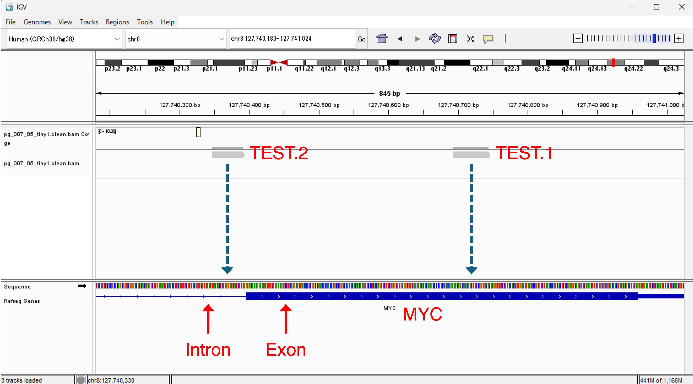
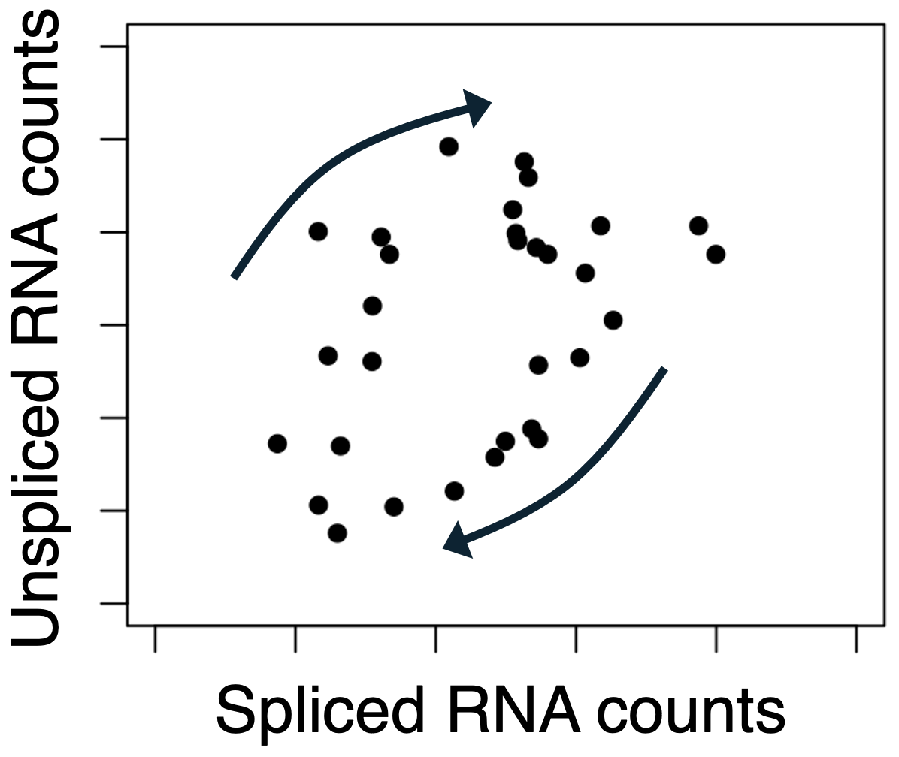

```{r, include = FALSE}
knitr::opts_chunk$set(
  collapse = TRUE,
  comment = "#>"
)
```


<br>

# Objective of this hands-on tutorial
This tutorial provides a practical introduction to processing raw single-cell
RNA sequencing (scRNA-seq) data using Drop-seq tools.
It serves as an accessible example for understanding how the core components of
the analysis pipeline work.

The aim is to gain hands-on experience by manually creating a minimal Drop-seq
dataset containing a single cell and a single human gene (MYC).
You will then follow the key steps of the pipeline:
converting FASTQ files into BAM format, mapping cDNA reads to a reference
genome, and counting reads.

<br>

<center>

</center>

<br>

By working through this minimal dataset, you will develop an intuitive
understanding of how FASTQ and BAM files are processed to generate read count
tables—knowledge that will help you make effective use of a wide range of public
scRNA-seq datasets such as Drop-seq data, 10x data, etc.


<br>

# Environmental Setup
## MiniDrop
Download MiniDrop to your working directory, which contains minimal example data
and scripts designed to simulate raw Drop-seq data processing.


<br>

## Dropseq Tools
To run MiniDrop, you'll need a Linux or Linux-like environment with the
following tools installed:

* samtools
* Picard
* Dropseq Tools
* STAR

**Note:** Unfortunately, macOS was not fully compatible in our pretests.
Support for macOS is under development.

We recommend using Conda to manage installation and dependencies easily.
Here is an example command to install Drop-seq Tools:

**Bash code**
```{bash, eval = FALSE}
conda install bioconda::dropseq_tools
```


<br>

## Move into the MiniDrop directory
**Bash code**
```{bash, eval = FALSE}
cd MiniDrop/bash
```

You will find the following files and directories:
```
001_data/
002_input/
003_bam/
004_fastq/
005_bam/
006_fastq/
007_bam/
008_count/
README.txt
all_initialize_runall.sh
pg_004_01_create_fastq.sh
pg_005_01_fastq2bam.sh
pg_005_02_cellbarcode_tag.sh
pg_005_03_umi_tag.sh
pg_005_04_read_qc.sh
pg_005_05_remove_adapter.sh
pg_005_06_trim_polya.sh
pg_005_07_bam2fastq.sh
pg_006_01_star__________wREF.sh
pg_007_01_sorting.sh
pg_007_02_cb_umi__________wREF.sh
pg_007_03_genes__________wREF.sh
pg_007_04_fix_beads.sh
pg_007_05_fix2nd_beads.sh
pg_008_01_counts.sh
```

**File Overview**<br>

* `README.txt`
Full explanation of each step and output
* `all_initialize_runall.sh`
Bash script initializing MiniDrop and execute all the process.

Scripts are named in the format `pg_NNN_NN_*.sh`, where the prefix indicates
the execution order.<br>
Scripts containing `__________wREF` in their names require reference genome
data.

**Directory Overview**<br>

* `001_data/`
Contains lightweight reference genome files focused on the MYC gene locus on
human chromosome 8.
* `002_input/`
Includes a file with the 12 bp cell barcode sequence and another file listing
genes by Ensembl ID.<br>
**Note:** The barcode sequence can be freely edited, but the reference genome used in this
package only covers MYC, so other genes are not supported.
* `003_bam/`
You can ignore this folder for the pipeline.
It includes MYC-aligned BAM fragments extracted from public datasets, intended
only for browsing or reference.
* `004_fastq/`
Stores the minimal FASTQ files generated by `pg_004_01_create_fastq.sh`.
These serve as the input for subsequent steps using Drop-seq tools.
* `005_bam/`
Output directory for scripts from `pg_005_01_*` through `pg_005_07_*`.
* `006_fastq/`
Stores FASTQ files generated by `pg_006_01_star__________wREF.sh`.
* `007_bam/`
Output directory for scripts from `pg_007_01_*` through `pg_007_05_*`.
* `008_count/`
Contains the final read count table, generated by `pg_008_01_counts.sh`.


<br>

# Step-by-Step Execution
## `pg_004_01_create_fastq.sh` {.unnumbered}
This script manually generates small FASTQ files based on reads extracted from `003_bam/tiny1.bam`.

**Bash code**
```{bash, eval = FALSE}
bash pg_004_01_create_fastq.sh
```

**Output files:**

* [`004_fastq/pg_004_01_tiny1_R1.fastq`](data/004_fastq/pg_004_01_tiny1_R1.fastq.txt)
* [`004_fastq/pg_004_01_tiny1_R2.fastq`](data/004_fastq/pg_004_01_tiny1_R2.fastq.txt)

These files contain three paired-end reads: `TEST.1`, `TEST.2`, and `TEST.3`.
In FASTQ format, each read is described by a block of four lines:

1. Header line: Begins with `@` followed by the read name.
2. Sequence line: The nucleotide sequence.
3. Plus line: A `+` character, optionally followed by the same identifier
(though this is usually omitted).
4. Quality line: ASCII-encoded quality scores corresponding to each base in the
sequence line.

The read names (e.g. `TEST.1`) are matched between R1 and R2, as this is
paired-end data.

`004_fastq/pg_004_01_tiny1_R1.fastq`
```{text}
@TEST.1
AATACAACGGTAGGAGCAAAT
+
IIIIFFFFF0BBBB<F<<<<<
@TEST.2
AATACAACGGTACCACCAAAT
+
IIIIIIIIIIIIBB<F<<<<<
@TEST.3
AATACAACGGTAAAAAAAAAT
+
IIIIIIFFFIIIIIIIIFFF#
```

In Drop-seq, Read 1 (R1) is expected to contain:
**Cell barcode (12 bp) + UMI (8 bp) + polyT.**

In these reads, the cell barcode is consistently `AATACAACGGTA`, indicating
that all reads originate from a single cell.
The UMIs are `GGAGCAAA`, `CCACCAAA`, and `AAAAAAAAA` for `TEST.1`, `TEST.2`,
and TEST.3, respectively.

`004_fastq/pg_004_01_tiny1_R2.fastq`
```{text}
@TEST.1
GAATGTCAAGAGGCGAACACACAACGTCTTGGAGCGCCAGAGGAGGAACGA
+
IIIIIIIIIIIIIIIIIIIIIIIIIIIIIIIIIIIIIIIIIIIIIIIIIII
@TEST.2
TTTAATGTAACCTTGCTAAAGGAGTGATTTCTATTTCCTTTCTTAAAAAAA
+
IIIIIIIIIIIIIIIIIIIIIIIIIIIIIIIIIIIIIIIIIIIIIIIIIII
@TEST.3
AAGCAGTGGTATCAACGCAGAGTGAATGGGTTTTTCCCCCGGGGGGTTTTT
+
IIIIIIIIIIIIIIIIIIIIIIIIIIIIIIIIIIIIIIIIIIIIIIIIIII
```

Although the sequences of `TEST.1` and `TEST.2` were designed based on known
MYC transcripts, it is not yet clear which specific region of MYC they
correspond to.
Therefore, the expression level of MYC cannot be precisely determined at this
stage.

The third read, `TEST.3`, is an artificial construct.
Its 5' end contains a typical Drop-seq adapter sequence,
`AAGCAGTGGTATCAACGCAGAGTGAATGGG`,
while the 3' end includes a meaningless pattern like `TT..CC..GG..TT`,
which does not reflect any real transcript.


<br>

## `pg_005_01_fastq2bam.sh` {.unnumbered}
This script uses Drop-seq Tools to convert the paired-end FASTQ files
(R1 and R2) into a single BAM file.

**Bash code**
```{bash, eval = FALSE}
bash pg_005_01_fastq2bam.sh
```

**Output files:**

* `005_bam/pg_005_01_tiny1.bam`
* [`005_bam/pg_005_01_tiny1.bam.sam`](data/005_bam/pg_005_01_tiny1.bam.sam.txt)

The `.sam` file is a human-readable text version of the BAM file.
It contains metadata in the header section and one alignment entry per line.
Each read from the FASTQ files appears as a separate line (one for R1,
one for R2).

`005_bam/pg_005_01_tiny1.bam.sam` (modified)
```{text}
@HD     VN:1.6  SO:queryname
@RG     ID:A    SM:tiny1
TEST.1  77   *  0  0  *  *  0  0  AATACAACGGTAGGAGCAAAT                               III...I  RG:Z:A
TEST.1  141  *  0  0  *  *  0  0  GAATGTCAAGAGGCGAACACACAACGTCTTGGAGCGCCAGAGGAGGAACGA III...I  RG:Z:A
TEST.2  77   *  0  0  *  *  0  0  AATACAACGGTACCACCAAAT                               III...I  RG:Z:A
TEST.2  141  *  0  0  *  *  0  0  TTTAATGTAACCTTGCTAAAGGAGTGATTTCTATTTCCTTTCTTAAAAAAA III...I  RG:Z:A
TEST.3  77   *  0  0  *  *  0  0  AATACAACGGTAAAAAAAAAT                               III...I  RG:Z:A
TEST.3  141  *  0  0  *  *  0  0  AAGCAGTGGTATCAACGCAGAGTGAATGGGTTTTTCCCCCAAAAAATTTTT III...I  RG:Z:A
```

As shown above, this BAM file contains information from both R1 and R2 reads,
paired by read name.

**Header Explanation**
```{text}
@HD     VN:1.6  SO:queryname
@RG     ID:A    SM:tiny1
```
* **@HD:** Header line
  - `VN:1.6`: SAM version 1.6.
  - `SO:queryname`: Indicates that the alignments are sorted by read (query)
    name.

* **@RG:** Read group
  - `ID:A`: Read group identifier "A".
  - `SM:tiny1`: Sample name.

**Alignment Lines** (modified)
```{text}
TEST.1  77   *  0  0  *  *  0  0  AAT...    III...    RG:Z:
TEST.1  141  *  0  0  *  *  0  0  GAA...... III...... RG:Z:A
...
TEST.3  77   *  0  0  *  *  0  0  AAT...    III...    RG:Z:A
TEST.3  141  *  0  0  *  *  0  0  AAG...... III...... RG:Z:A
```
* **77:** SAM flag for Read 1 (first in pair), paired, unmapped
      `77 = 64 (Read 1) + 13 (unmapped flags)`.
* **141:** SAM flag for Read 2 (second in pair), paired, unmapped
       `141 = 128 (Read 2) + 13 (unmapped flags)`.
* **RG:Z:A:** Indicates this read belongs to read group A.

You can use Picard’s **Explain SAM Flags** tool to interpret the bitwise flag
values:

https://broadinstitute.github.io/picard/explain-flags.html


<br>

## `pg_005_02_cellbarcode_tag.sh` {.unnumbered}
This script uses Drop-seq Tools to add cell barcode (CB) tags to the BAM file.

**Bash code**
```{bash, eval = FALSE}
bash pg_005_02_cellbarcode_tag.sh
```

**Output files:**

* `005_bam/pg_005_02_tiny1.cb.bam`
* [`005_bam/pg_005_02_tiny1.cb.bam.sam`](data/005_bam/pg_005_02_tiny1.cb.bam.sam.txt)

The resulting `.bam` and `.sam` files are nearly identical to the previous ones,
but with an important addition:  
Read 2 (R2) of each read pair now includes an extra tag, `XC:Z:<cell_barcode>`,
which represents the cell barcode extracted from the R1 read.

**Example of Cell Barcode Tags** (modified)
```{text}
TEST.1  77   *  0  0  *  *  0  0  AAT...    III...                       RG:Z:A
TEST.1  141  *  0  0  *  *  0  0  GAA...... III...... XC:Z:AATACAACGGTA  RG:Z:A
...
TEST.3  77   *  0  0  *  *  0  0  AAT...    III...                       RG:Z:A
TEST.3  141  *  0  0  *  *  0  0  TTT...... III...... XC:Z:AATACAACGGTA  RG:Z:A
```

* `XC:Z`: is the tag format used for cell barcodes.
  - XC: Tag name (Drop-seq convention).
  - Z: Denotes that the value is a string.
  - `AATACAACGGTA`: The 12-bp cell barcode sequence.
* This tag is only added to Read 2 (R2). R1 is used to extract the barcode,
but the actual barcode tag is added to R2.

**Note:** The tag name `XC` is assumed by many downstream Drop-seq tools.
Renaming it is technically possible, but not recommended, as some tools rely on
this default convention.


<br>

## `pg_005_03_umi_tag.sh` {.unnumbered}
This script uses Drop-seq tools to tag each read with its UMI (8 bp) sequence.

**Bash code**
```{bash, eval = FALSE}
bash pg_005_03_umi_tag.sh
```

**Output files:**

* `005_bam/pg_005_03_tiny1.cb.umi.bam`  
* [`005_bam/pg_005_03_tiny1.cb.umi.bam.sam`](data/005_bam/pg_005_03_tiny1.cb.umi.bam.sam.txt)

**Example with UMI Tags** (modified)
```{text}
TEST.1  4  *  0  0  *  *  0  0  GAA... III... XC:Z:AATACAACGGTA  RG:Z:A XM:Z:GGAGCAAA
TEST.2  4  *  0  0  *  *  0  0  TTT... III... XC:Z:AATACAACGGTA  RG:Z:A XM:Z:CCACCAAA
TEST.3  4  *  0  0  *  *  0  0  AAG... III... XC:Z:AATACAACGGTA  RG:Z:A XM:Z:AAAAAAAA
```

* `XM:Z`: indicates the UMI tag (Unique Molecular Identifier).
* `XC:Z`: remains as the cell barcode tag.
* Flag `4` = unmapped read.
* Reads are typically collapsed (merged) at this stage.

**Note:** `XM` is the default tag for UMI.
Renaming is possible, but not recommended.


<br>

## `pg_005_04_read_qc.sh` {.unnumbered}
This script filters out reads with low-quality cell barcodes (`XC`) using
Drop-seq tools.

**Bash code**
```{bash, eval = FALSE}
bash pg_005_04_read_qc.sh
```

**Output files:**

* `005_bam/pg_005_04_tiny1.cb.umi.qc.bam`
* [`005_bam/pg_005_04_tiny1.cb.umi.qc.bam.sam`](data/005_bam/pg_005_04_tiny1.cb.umi.qc.bam.sam.txt)

In this example, the input reads are high-quality, so the output is unchanged.

**Practice Tip:** Try simulating FASTQ files with low-quality reads to see how
they are filtered out in the resulting BAM file.


<br>

## `pg_005_05_remove_adapter.sh` {.unnumbered}
This script removes the SMART adapter sequence:
`AAGCAGTGGTATCAACGCAGAGTGAATGGG`
from the beginning of cDNA reads (5').

**Bash code**
```{bash, eval = FALSE}
bash pg_005_05_remove_adapter.sh
```

**Output files:**

* `005_bam/pg_005_05_tiny1.cb.umi.qc.woAdapter.bam`
* [`005_bam/pg_005_05_tiny1.cb.umi.qc.woAdapter.bam.report.txt`](data/005_bam/pg_005_05_tiny1.cb.umi.qc.woAdapter.bam.report.txt)
* [`005_bam/pg_005_05_tiny1.cb.umi.qc.woAdapter.bam.sam`](data/005_bam/pg_005_05_tiny1.cb.umi.qc.woAdapter.bam.sam.txt)

`005_bam/pg_005_05_tiny1.cb.umi.qc.woAdapter.bam.sam` (modified)
```{text}
TEST.1  4  *  0  0  *  *  0  0  GAATGTCAAGAGGCGAACACACAACGTCTTGGAGCGCCAGAGGAGGAACGA III... XC:Z:AAT... RG:Z:A XM:Z:GGA...
TEST.2  4  *  0  0  *  *  0  0  TTTAATGTAACCTTGCTAAAGGAGTGATTTCTATTTCCTTTCTTAAAAAAA III... XC:Z:AAT... RG:Z:A XM:Z:CCA...
TEST.3  4  *  0  0  *  *  0  0  TTTTTCCCCCAAAAAATTTTT                               III... XC:Z:AAT... RG:Z:A XM:Z:AAA... ZS:i:30
```

* `ZS:i:30`: Indicates 30 bases were trimmed from the 5' end.
* For `TEST.3`, the adapter sequence was removed:
```{text}
Before:  AAGCAGTGGTATCAACGCAGAGTGAATGGGTTTTTCCCCCGGGGGGTTTTT
After:                                 TTTTTCCCCCGGGGGGTTTTT
```

**Note:** Adapter trimming is crucial for proper downstream alignment.


<br>

## `pg_005_06_trim_polya.sh` {.unnumbered}
This script trims polyA tails from the 3' end of reads.
The tail is detected when NUM_BASES or more consecutive A bases are found
(default: 6).

**Bash code**
```{bash, eval = FALSE}
bash pg_005_06_trim_polya.sh
```

**Output files:**

* `005_bam/pg_005_06_tiny1.cb.umi.qc.woAdapter.trimPolyA.bam`
* [`005_bam/pg_005_06_tiny1.cb.umi.qc.woAdapter.trimPolyA.bam.report.txt`](data/005_bam/pg_005_06_tiny1.cb.umi.qc.woAdapter.trimPolyA.bam.report.txt)
* [`005_bam/pg_005_06_tiny1.cb.umi.qc.woAdapter.trimPolyA.bam.sam`](data/005_bam/pg_005_06_tiny1.cb.umi.qc.woAdapter.trimPolyA.bam.sam.txt)

`005_bam/pg_005_06_tiny1.cb.umi.qc.woAdapter.trimPolyA.bam.sam`
```{text}
TEST.1  4  *  0  0  *  *  0  0  GAATGTCAAGAGGCGAACACACAACGTCTTGGAGCGCCAGAGGAGGAACGA III... XC:Z:AAT... RG:Z:A XM:Z:GGA...
TEST.2  4  *  0  0  *  *  0  0  TTTAATGTAACCTTGCTAAAGGAGTGATTTCTATTTCCTTTCTT        III... XC:Z:AAT... RG:Z:A XM:Z:CCA... ZP:i:45
TEST.3  4  *  0  0  *  *  0  0  TTTTTCCCCCAAAAAATTTTT                               III... XC:Z:AAT... RG:Z:A XM:Z:AAA... ZS:i:30
```

For `TEST.2`, a new tag "`ZP:i:45`" appeared at the end, which means that polyA
was detected from 45th base, which were trimmed here:

```{text}
Before:  CAAGAGGCGAACACACAACGTCTTGGAGCGCCAGAGGAGGAACGAAAAAAA
After:   CAAGAGGCGAACACACAACGTCTTGGAGCGCCAGAGGAGGAACG
```

Reads like `TEST.3` with internal A-rich regions are not trimmed:


<br>

## `pg_005_07_bam2fastq.sh` {.unnumbered}
This script converts BAM to FASTQ using Drop-seq tools.

**Bash code**
```{bash, eval = FALSE}
bash pg_005_07_bam2fastq.sh
```

**Output files:**

* [`006_fastq/pg_005_07_tiny1.cb.umi.qc.woAdapter.trimPolyA.fastq`](data/006_fastq/pg_005_07_tiny1.cb.umi.qc.woAdapter.trimPolyA.fastq.txt)

`006_fastq/pg_005_07_tiny1.cb.umi.qc.woAdapter.trimPolyA.fastq`
```{text}
@TEST.1
GAATGTCAAGAGGCGAACACACAACGTCTTGGAGCGCCAGAGGAGGAACGA
+
IIIIIIIIIIIIIIIIIIIIIIIIIIIIIIIIIIIIIIIIIIIIIIIIIII
@TEST.2
TTTAATGTAACCTTGCTAAAGGAGTGATTTCTATTTCCTTTCTT
+
IIIIIIIIIIIIIIIIIIIIIIIIIIIIIIIIIIIIIIIIIIII
@TEST.3
TTTTTCCCCCGGGGGGTTTTT
+
IIIIIIIIIIIIIIIIIIIII
```


<br>

## `pg_006_01_star__________wREF.sh` {.unnumbered}
This script runs **STAR** to align reads to the reference genome.

**Bash code**
```{bash, eval = FALSE}
bash pg_006_01_star__________wREF.sh
```

**Output files:**

* [`006_fastq/pg_006_01_tiny1.star_Aligned.out.sam`](data/006_fastq/pg_006_01_tiny1.star_Aligned.out.sam.txt)
* [`006_fastq/pg_006_01_tiny1.star_Log.final.out`](data/006_fastq/pg_006_01_tiny1.star_Log.final.out.txt)
* [`006_fastq/pg_006_01_tiny1.star_Log.out`](data/006_fastq/pg_006_01_tiny1.star_Log.out.txt)
* [`006_fastq/pg_006_01_tiny1.star_Log.progress.out`](data/006_fastq/pg_006_01_tiny1.star_Log.progress.out.txt)
* [`006_fastq/pg_006_01_tiny1.star_SJ.out.tab`](data/006_fastq/pg_006_01_tiny1.star_SJ.out.tab.txt)

**Note:** Tags such as `XC` (cell barcode) and `XM` (UMI) are **not retained**
in the STAR output.
Only alignment information is included.

**Header Explanation** (`006_fastq/pg_006_01_tiny1.star_Aligned.out.sam`)

* `@SQ`: Sequence Dictionary, describing information about each chromosome and
         contig in the reference genome.
  - `SN:8`: Reference sequence name (e.g., chromosome 8).
  - `LN:145138636`: Reference sequence length (e.g., 145,138,636 bp).

**Alignment Lines** (`006_fastq/pg_006_01_tiny1.star_Aligned.out.sam`)
```{text}
TEST.1  0    8  127740694  255  51M    *  0  0  GAATGTCAAGAGGCGAACACA... III... NH:i:1 HI:i:1 AS:i:50 nM:i:0
TEST.2  0    8  127740348  255  44M    *  0  0  TTTAATGTAACCTTGCTAAAG... III... NH:i:1 HI:i:1 AS:i:43 nM:i:0
TEST.3  256  8  139003813  0    13M8S  *  0  0  TTTTTCCCCCGGGGGGTTTTT    III... NH:i:7 HI:i:1 AS:i:12 nM:i:0
TEST.3  256  8  38719248   0    13M8S  *  0  0  TTTTTCCCCCGGGGGGTTTTT    III... NH:i:7 HI:i:2 AS:i:12 nM:i:0
TEST.3  16   8  70608363   0    5S16M  *  0  0  AAAAACCCCCCGGGGGAAAAA    III... NH:i:7 HI:i:3 AS:i:13 nM:i:1
TEST.3  256  8  132058839  0    13M8S  *  0  0  TTTTTCCCCCGGGGGGTTTTT    III... NH:i:7 HI:i:4 AS:i:12 nM:i:0
TEST.3  272  8  72390115   0    13M8S  *  0  0  AAAAACCCCCCGGGGGAAAAA    III... NH:i:7 HI:i:5 AS:i:12 nM:i:0
TEST.3  272  8  80279758   0    20M1S  *  0  0  AAAAACCCCCCGGGGGAAAAA    III... NH:i:7 HI:i:6 AS:i:13 nM:i:3
TEST.3  256  8  7714463    0    6S15M  *  0  0  TTTTTCCCCCGGGGGGTTTTT    III... NH:i:7 HI:i:7 AS:i:12 nM:i:1
```

**Observation:** `TEST.3` appears multiple times, showing multi-mapping
behavior.

For BAM flags, reference the following:
  https://broadinstitute.github.io/picard/explain-flags.html

* `@CO`:                        This is a comment header describing the used command.
* `TEST.1  0`:                  Single-end reads that are uniquely aligned in the
                                sense direction. Although the original data is
                                paired-end, the created BAM file appears single-end.
* `TEST.1  ...  8  127740694`:  This read was aligned onto this position in
                                chromosome 8.
* `TEST.1  ...  255`:           This alignment is unique, but sometimes means
                                "invalid."
* `TEST.1  ...  51M`:           CIGAR string, describing how many aligned reads have
                                mappings, insertions, deletions, etc.
* `TEST.1  ...  *  0  0`:       RNEXT, PNEXT, TLEN, where
                                RNEXT: read name of the partner, "*,"
                                PNEXT: read position of the partner, "0,"
                                TLEN: total length of the template, "0."
* `NH:i:1`:                     The total number of locations this read was mapped to.
* `HI:i:1`:                     Hit index (to distinguish between multiple hits).
* `AS:i:50`:                    Alignment score (higher is better). It equals
                                −10 log10 Pr{mapping position is wrong},
                                rounded to the nearest integer.
* `nM:i:0`:                     Number of nucleotide mismatches.

**Note:** STAR often splits a single read into multiple alignments, especially
if it's multi-mappable or contains soft-clipping (e.g., 13M8S).


<br>

## `pg_007_01_sorting.sh` {.unnumbered}
This script sorts BAM by query name using Picard's SortSam, preparing for later
merging steps.

**Bash code**
```{bash, eval = FALSE}
bash pg_007_01_sorting.sh
```

**Output files:**

* `007_bam/pg_007_01_tiny1.aligned.sorted.bam`
* [`007_bam/pg_007_01_tiny1.aligned.sorted.bam.sam`](data/007_bam/pg_007_01_tiny1.aligned.sorted.bam.sam.txt)

**Note:** Sorting only affects tag order; sequence content remains unchanged.


<br>

## `pg_007_02_cb_umi__________wREF.sh` {.unnumbered}
This script uses Picard’s `MergeBamAlignment` to integrate STAR-aligned BAM
(which lacks barcode tags) with the original BAM file that includes cell
barcode (XC) and UMI (XM) tags.

**Bash code**
```{bash, eval = FALSE}
bash pg_007_02_cb_umi__________wREF.sh
```

**Input files:**

* Aligned BAM:<br>
  `007_bam/pg_007_01_tiny1.aligned.sorted.bam`
* Tagged BAM:<br>
  `005_bam/pg_005_06_tiny1.cb.umi.qc.woAdapter.trimPolyA.bam`

**Output files:**

* `007_bam/pg_007_02_tiny1.merged.bam`
* [`007_bam/pg_007_02_tiny1.merged.bam.sam`](data/007_bam/pg_007_02_tiny1.merged.bam.sam.txt)

**Merged SAM example (`007_bam/pg_007_02_tiny1.merged.bam.sam`):**
```{text}
@HD     VN:1.5  SO:coordinate
@SQ     SN:8    LN:145138636    M5:c67955b5f...
@RG     ID:A    SM:tiny1
@PG     ID:STAR PN:STAR VN:2.7.11b      CL:...
TEST.2 ... 44M   ... TTT...... III... XC:Z:AAT... MD:Z:44   ... XM:Z:CCA... ZP:i:45 UQ:i:0  AS:i:43
TEST.1 ... 51M   ... GAA...... III... XC:Z:AAT... MD:Z:51   ... XM:Z:GGA... UQ:i:0  AS:i:50
TEST.3 ...           TTT...    III... XC:Z:AAT... PG:Z:STAR ... XM:Z:AAA... ZS:i:30
```

**Explanation of fields:**

* `MD:Z:2G13`: Mismatch descriptor.
  2 bases match, followed by a mismatch (G in the reference), then 13 matches.
  Useful for pinpointing SNPs or errors.
* `UQ:i:0`: Uncertainty Quality.
  Sum of base quality scores at mismatched positions.
  - `0` means no mismatches.
  - Higher values indicate more uncertainty in the alignment.
* `ZS:i:30`: STAR-derived tag indicating how many bases were trimmed at the
  start (e.g., adapter removal).
  Often useful in preprocessing QC.
* `ZP:i:45`: A custom alignment confidence metric
  (e.g., Picard or STAR-derived).
  - Larger values suggest higher uniqueness and better confidence.
  - May be used in downstream filtering.


<br>

## `pg_007_03_genes__________wREF.sh` {.unnumbered}
This script uses genomic (gene-level) annotations to tag each aligned read with
gene-related information: gene name (`GE`), gene ID (`GN`), and transcript
region (`XF`: `exonic`/`intronic`/`intergenic`/`UTR`/etc.),
such as exonic, intronic, intergenic, or untranslated region.

**Bash code**
```{bash, eval = FALSE}
bash pg_007_03_genes__________wREF.sh
```

**Output files:**

* `007_bam/pg_007_03_tiny1.star_gene_exon_tagged.bam`
* [`007_bam/pg_007_03_tiny1.star_gene_exon_tagged.bam.sam`](data/007_bam/pg_007_03_tiny1.star_gene_exon_tagged.bam.sam.txt)

`007_bam/pg_007_03_tiny1.star_gene_exon_tagged.bam.sam`
```{text}
TEST.2 ... XC:Z:AAT... XF:Z:INTRONIC ... XM:Z:CCA... gf:Z:INTRONIC gn:Z:ENSG00000136997 gs:Z:+
TEST.1 ... XC:Z:AAT... XF:Z:CODING   ... XM:Z:GGA... gf:Z:CODING   gn:Z:ENSG00000136997 gs:Z:+
TEST.3 ... XC:Z:AAT...                   XM:Z:AAA... ZS:i:30
```

**Explanation of tags:**

* `XF:Z:INTRONIC`
  Transcript region classification.
  Possible values:
  - `CODING`: aligned to a coding exon.
  - `INTRONIC`: aligned within an intron.
  - `UTR`: aligned to an untranslated region.
  - `INTERGENIC`: aligned outside any annotated gene.
* `gf:Z:INTRONIC`
  Gene function tag (duplicate of `XF`) added for compatibility with tools
  expecting this key.
* `gn:Z:ENSG00000175806`
  Gene ID from Ensembl.
  Indicates which gene the read maps to.
* `gs:Z:+`
  Strand of the gene.
  Useful for determining the directionality of transcription and read
  orientation:
  - `+`: forward strand.
  - `-`: reverse strand.


<br>

## `pg_007_04_fix_beads.sh` {.unnumbered}
This script corrects single-nucleotide substitution errors in cell barcodes
(e.g., changing `GTTAC` to `GTTTC`), which are often introduced by sequencing.

**Bash code**
```{bash, eval = FALSE}
bash pg_007_04_fix_beads.sh
```

**Output files:**

* `007_bam/pg_007_04_tiny1.clean_substitution.bam`
* [`007_bam/pg_007_04_tiny1.clean_substitution.bam.sam`](data/007_bam/pg_007_04_tiny1.clean_substitution.bam.sam.txt)
* `007_bam/tmp/`
* [`007_bam/pg_007_04_tiny1.clean_substitution.bam.report.txt`](data/pg_007_04_tiny1.clean_substitution.bam.report.txt)

**Notes:**

* The corrected BAM file is almost identical to the input, except for an added
  `@PG ID:1` line in the SAM header.
* If similar barcodes share the same UMI sequences, they may be merged and
  considered variants ("subtypes") of the same cell.

**Tip:** You can test this behavior by manually introducing point mutations into
barcodes in a FASTQ file and observing how they are corrected in the resulting
BAM.


<br>

## `pg_007_05_fix2nd_beads.sh` {.unnumbered}
**Bash code**
```{bash, eval = FALSE}
bash pg_007_05_fix2nd_beads.sh
```

**Output files:**

* `007_bam/pg_007_05_tiny1.clean.bam`
* `007_bam/pg_007_05_tiny1.clean.bam.bai`
* [`007_bam/pg_007_05_tiny1.clean.bam.sam`](data/007_bam/pg_007_05_tiny1.clean.bam.sam.txt)
* [`007_bam/pg_007_05_tiny1.clean.bam.clean.indel_report.txt`](data/007_bam/pg_007_05_tiny1.clean.bam.clean.indel_report.txt)
* [`007_bam/pg_007_05_tiny1.clean.bam.synthesis_stats.summary.txt`](data/007_bam/pg_007_05_tiny1.clean.bam.synthesis_stats.summary.txt)
* [`007_bam/pg_007_05_tiny1.clean.bam.synthesis_stats.txt`](data/007_bam/pg_007_05_tiny1.clean.bam.synthesis_stats.txt)

This script corrects synthesis errors in cell barcodes, especially insertions
and deletions (indels).
These errors may result in clusters of nearly identical barcodes due to faulty
oligo synthesis during bead manufacturing.

In addition, the script runs the following command:

**Bash code**
```{bash, eval = FALSE}
samtools index 007_bam/pg_007_05_tiny1.clean.bam
```
This creates an index file called `007_bam/pg_007_05_tiny1.clean.bam.bai`.

This index file allows tools like IGV to quickly access specific regions of the
BAM file without having to load the entire file into memory.
It is essential for efficient visualisation and navigation of alignments.


<br>

## `pg_008_01_counts.sh` {.unnumbered}
This script counts the number of reads mapped to each gene for each cell.

**Bash code**
```{bash, eval = FALSE}
bash pg_008_01_counts.sh
```

**Output files:**

* [`008_count/pg_008_01_tiny1.txt.gz`](data/008_count/pg_008_01_tiny1.txt)
* [`008_count/pg_008_01_tiny1.txt.gz.summary.txt`](data/008_count/pg_008_01_tiny1.txt.gz.summary.txt)

`008_count/pg_008_01_tiny1.txt.gz`
```{text}
GENE    AATACAACGGTA
ENSG00000136997 1
```

Each row represents a gene, and each column (after the first) represents a cell
barcode.
The values indicate how many reads from that cell were assigned to that gene.


<br>

# Integrated Genome Viewer (IGV)
The Integrated Genome Viewer (IGV) is a graphical user interface (GUI) that
allows you to visually inspect where each sequencing read has been mapped on
the reference genome.

For example, you can load the final BAM file `pg_007_05_tiny1.clean.bam`
into IGV to explore the alignment results.

<br>

<center>

</center>

<br>

As shown above, it's immediately clear that read `TEST.1` maps to an exon,
while `TEST.2` maps to an intron.
This kind of visualisation helps confirm whether reads originate from spliced
or unspliced transcripts, which is critical in analyses such as RNA velocity
(see Discussion).


<br>

# Discussion
Many publicly available scRNA-seq datasets come in the form of large FASTQ files
(often compressed as **SRA** files) or **BAM** files, often several gigabytes
in size.
While downloading them is straightforward, understanding their internal
structure can be overwhelming.

With MiniDrop, the entire processing for raw scRNA-seq data—from input to final
output—is made fully transparent.
The starting input consists of paired FASTQ files (R1 and R2), and since the
structure of forward and reverse reads is known, the contents of each file can
be understood simply by inspecting them.

Using `pg_005_01_fastq2bam.sh`, these FASTQ files were first merged into a
single BAM file.
Then, through the `pg_005` scripts, the internal structure of that BAM file was
systematically organised.
After removing artifacts, a single transcript FASTQ file was reconstructed via
`pg_005_07_bam2fastq.sh`, and these reads were aligned to the reference genome
using `pg_006_01_star__________wREF.sh`.

Subsequently, cell barcode and gene annotation information were fully integrated
into the BAM file using `pg_007_02_cb_umi__________wREF.sh` and
`pg_007_03_genes__________wREF.sh`.

Finally, `pg_008_01_counts.sh` counted the number of reads mapped to each gene
per cell.

<br>

Three key insights emerge from this process:

#### (1) Distinguishing nascent RNA from mature mRNA {.unnumbered}
Drop-seq tools can differentiate whether each read originates from unspliced
nascent RNA containing introns or from fully spliced mature mRNA.
These are respectively labeled as intronic (unspliced) and exonic (spliced).

For example, in:
`007_bam/pg_007_03_tiny1.star_gene_exon_tagged.bam.sam`
```{text}
TEST.2 ... XC:Z:AAT... XF:Z:INTRONIC ... XM:Z:CCA... gf:Z:INTRONIC gn:Z:ENSG00000136997 gs:Z:+
TEST.1 ... XC:Z:AAT... XF:Z:CODING   ... XM:Z:GGA... gf:Z:CODING   gn:Z:ENSG00000136997 gs:Z:+
```
By aggregating this information across many cells and plotting them in the
spliced–unspliced space, one can infer whether a gene is currently being
actively transcribed in a given cell—a foundational concept in
[RNA velocity analysis](https://pubmed.ncbi.nlm.nih.gov/30089906/).

<br>

<center>

</center>

<br>

#### (2) 3' bias {.unnumbered}
In the Drop-seq protocol, only fragments containing the 5′ portion of the
original primer (i.e., Cell Barcode and UMI) are retained after selection,
which introduces a strong 3′ bias.

<br>

<center>

</center>

<br>

To what extent does this bias affect the data, and can it be quantified?<br>
Moreover, how might it influence downstream analyses, such as RNA velocity?


<br>

#### (3) Counting only exonic reads {.unnumbered}
The script `pg_008_01_counts.sh` includes only exonic reads in the gene-by-cell
count matrix.
This design decision ensures that the count table represents mature mRNA
abundance, as is standard in many downstream analyses.
